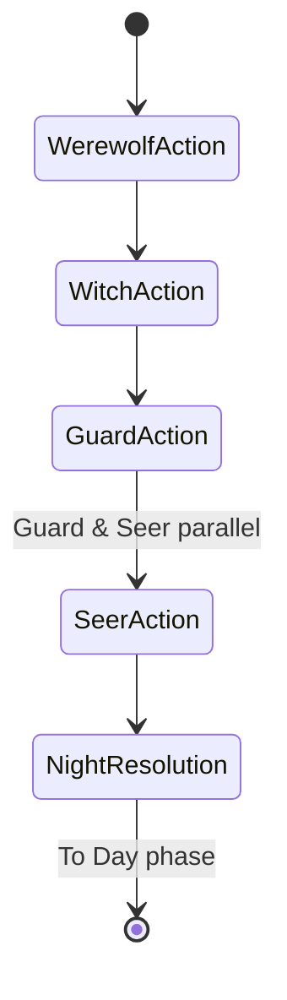
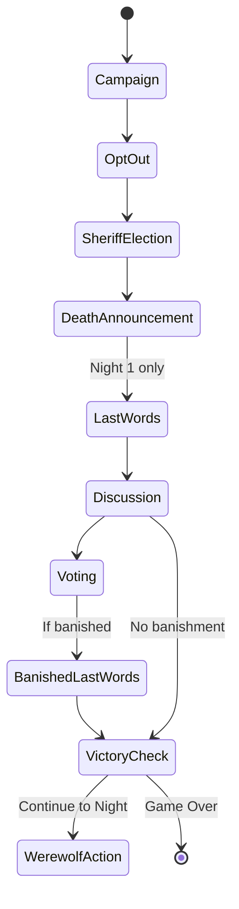
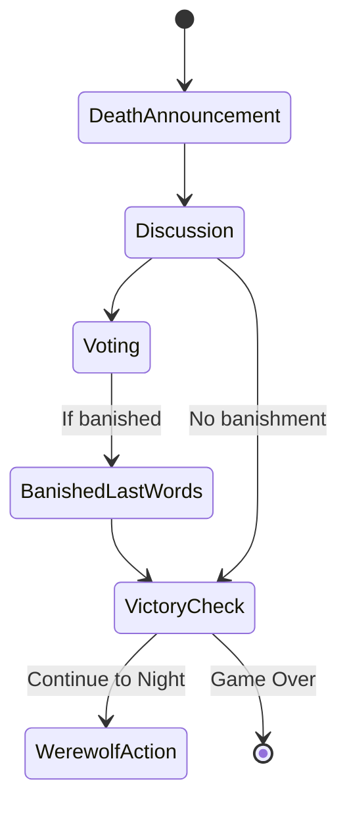

# Phase Definitions

## Macro Phases

| Phase | Description |
|-------|-------------|
| NIGHT | Night actions, resolves into deaths |
| DAY | Day activities, may resolve into banishments |
| GAME_OVER | Victory/defeat reached |

## Micro Phases

### Night Sub-Phases

| Sub-Phase | Description |
|-----------|-------------|
| Werewolf Action | Werewolves choose kill target (single AI decision) |
| Witch Action | Witch chooses antidote/poison/pass (knows werewolf target) |
| Guard Action | Guard chooses player to protect (may skip) |
| Seer Action | Seer chooses player to check |
| Resolution | Calculate deaths, update state |

### Day Sub-Phases

| Sub-Phase | Description |
|-----------|-------------|
| Campaign | Day 1 only: Candidates give speeches |
| Opt-Out | Day 1 only: Candidates may drop out |
| Sheriff Election | Day 1 only: Vote for Sheriff |
| Death Announcement | Reveal who died (name only, no cause/role) |
| Last Words | Night deaths speak (Night 1 only) |
| Discussion | Players speak in order |
| Voting | Vote to banish |
| Banished Last Words | Day death speaks before leaving |

---

## Night Phase Flow

| Step | Actor | Action |
|------|-------|--------|
| 1 | Werewolves | Choose kill target (single AI call) |
| 2 | Witch | Choose: antidote, poison, or pass |
| 3 | Guard | Choose player to protect (may skip) |
| 4 | Seer | Choose player to check |
| 5 | Resolve | Calculate deaths, update state |

**Notes:**
- Werewolves act first, then Witch
- Guard and Seer can act in parallel (any order)
- Witch sees werewolf's target before deciding
- All night deaths announced together at next day start

---

## Day Phase Flow (Day 1)

| Step | Description |
|------|-------------|
| 1. Campaign | Candidates give speeches |
| 2. Opt-Out | Candidates may drop out of the race |
| 3. Sheriff Election | Vote for Sheriff (no abstention) |
| 4. Death Announcement | Reveal who died (name only, no cause/role) |
| 5. Last Words | Night deaths speak |
| 6. Discussion | Players speak in order |
| 7. Voting | Vote to banish |
| 8. Banished Last Words | Player speaks before leaving |

---

## Day Phase Flow (Day 2+)

| Step | Description |
|------|-------------|
| 1. Death Announcement | Reveal who died (name only, no cause/role) |
| 2. Discussion | Players speak in order |
| 3. Voting | Vote to banish |
| 4. Banished Last Words | Player speaks before leaving |

**Note:** Victory check happens automatically after deaths (Day 1 & 2+) and after voting. If game ends, no further events occur.

---

## State Diagrams

### Night Phase Flow

### Day 1 Flow

### Day 2+ Flow

---

## Victory Check

Victory conditions are checked:
- After death announcement (if all werewolves killed, villagers win)
- After banishment (if all werewolves banished, villagers win)
- After deaths (if all gods killed or all ordinary villagers killed, werewolves win)

---

## Sheriff Election (Day 1)

1. Candidates give campaign speeches
2. Candidates may opt-out (drop out of the race)
3. Remaining candidates are locked in
4. Players vote (no abstention, Sheriff vote = 1.5)
5. Majority wins
6. If tie: no Sheriff elected

---

## Vote Resolution

### Normal Voting

1. All living players vote (abstention allowed, except Sheriff election)
2. Count votes (Sheriff's vote = 1.5)
3. Highest vote count is banished

### PK Round (Tie)

1. Tied players give speeches
2. Revote
3. If still tied: no one banished

---

## Special Rules

### Werewolf Night Decision

- One AI API call for the werewolf group as a whole
- Werewolves act as a single entity (no internal "discussion")

### Speaker Order

- Sheriff speaks LAST
- Others speak in alternating clockwise/counter-clockwise order

### Death Events

- Night deaths: Announced at day start, resolved together
- Day deaths: Occur after vote-out or Hunter shoot
- Hunter shoot: Happens immediately when triggered
- Sheriff badge: Transferred by Sheriff (if alive) or inherited
- Multiple death events: Processed in any order
