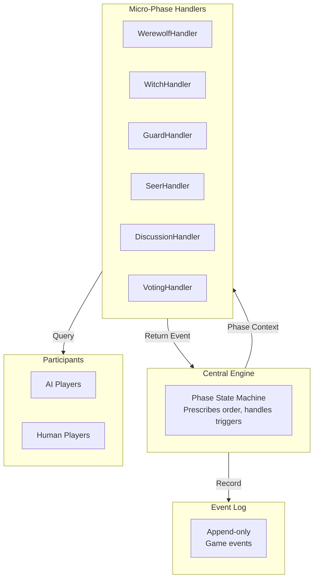
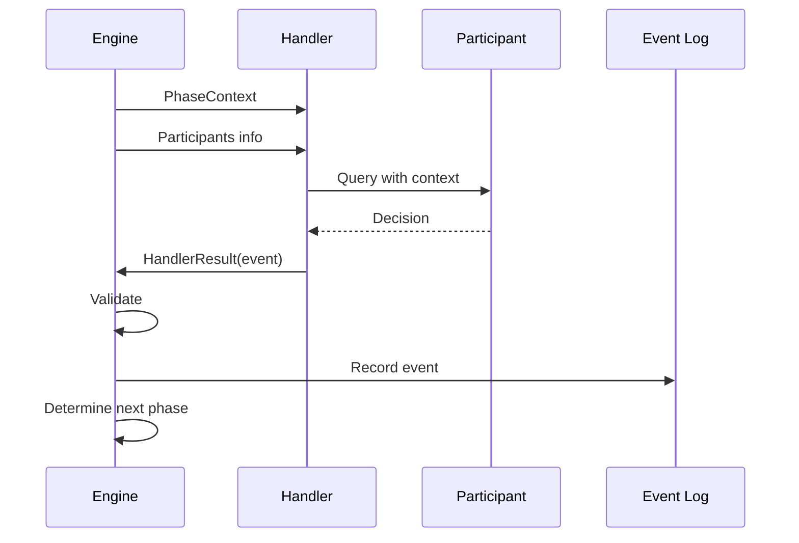

# Micro-Phase Handlers: Input & Output Specification

## Overview

Micro-phase handlers are **system components** that:
1. Receive context about the current game state
2. Query participants (AI or human) for decisions
3. Return game events for the engine to process

The engine controls phase transitions. Handlers manage the flow within their assigned subphase.

---

## Architecture



---

## Handler Interface

### Input: PhaseContext

```python
class PhaseContext(BaseModel):
    """Context passed to handlers by the engine."""

    # Current phase identification
    phase: Phase  # NIGHT, DAY, or GAME_OVER
    micro_phase: MicroPhase  # Specific subphase

    # Game state
    day: int
    night: int

    # Player state
    players: dict[int, Player]  # Full player state
    living_players: set[int]
    dead_players: set[int]

    # Night actions accumulated so far (for night phases)
    night_actions: Optional[NightActionAccumulator] = None

    # Current Sheriff (for vote weight and speaking order)
    sheriff: Optional[int] = None

    # Phase-specific data (candidates, etc.)
    phase_data: Optional[dict] = None
```

### Output: HandlerResult

```python
class HandlerResult(BaseModel):
    """Standard output from handlers."""

    # Primary output
    event: Optional[GameEvent] = None

    # Next actor for multi-actor phases
    next_actor: Optional[int] = None

    # State mutations (applied by engine after validation)
    state_mutations: dict[str, Any] = Field(default_factory=dict)

    # Skip this phase entirely
    was_skipped: bool = False
    skip_reason: Optional[str] = None

    # Debug info
    debug_info: Optional[str] = None
```

---

## Per-Subphase Input/Output

### Night Subphases

| SubPhase | Input Context | Output Event | Next Phase |
|----------|---------------|--------------|------------|
| **WerewolfAction** | Any werewolf | `WerewolfKill` | WitchAction |
| **WitchAction** | Witch, `night_actions.kill_target` | `WitchAction` | GuardAction |
| **GuardAction** | Guard, `night_actions` | `GuardAction` | SeerAction |
| **SeerAction** | Seer | `SeerAction` | NightResolution |
| **NightResolution** | All night actions | `NightResolution` | VictoryCheck or Day |

### Day Subphases

| SubPhase | Input Context | Output Event | Next Phase |
|----------|---------------|--------------|------------|
| **Campaign** | Candidate | `Speech` | Next candidate or OptOut |
| **OptOut** | Candidate | `SheriffOptOut` | Next candidate or SheriffElection |
| **SheriffElection** | All `living_players` | `SheriffElection` | DeathAnnouncement |
| **DeathAnnouncement** | Dead players from night | `DeathAnnouncement` | VictoryCheck or LastWords or Discussion |
| **LastWords** | Dead player | `Speech` | Next dead or Discussion |
| **Discussion** | Speaker | `Speech` | Next speaker or Voting |
| **Voting** | Voter | `Vote` | Next voter or BanishedLastWords |
| **BanishedLastWords** | Banished player | `Speech` | VictoryCheck |
| **VictoryCheck** | Full state | `VictoryCheck` | GAME_OVER or Next Phase |
| **HunterShoot** | Hunter | `HunterShoot` | BadgeTransfer or Next |
| **BadgeTransfer** | Sheriff info | `SheriffBadgeTransfer` | VictoryCheck or Next |

---

## Detailed Subphase Specifications

### WerewolfAction

**Purpose:** Werewolves decide on a kill target.

**Input:**
```
- players: Full state with roles
- living_players: All living players
```

**Output:**
```python
WerewolfKill(
    actor=int,  # Any werewolf
    target=int | None,  # None = no kill
    day=day,
    phase=Phase.NIGHT,
    micro_phase=MicroPhase.WEREWOLF_ACTION
)
```

**Rules:**
- If no werewolves alive, phase is skipped
- Target must be a living player

---

### WitchAction

**Purpose:** Witch decides to use antidote, poison, or pass.

**Input:**
```
- players: Full state
- living_players: Living players
- night_actions.kill_target: Who werewolves targeted
```

**Output:**
```python
WitchAction(
    actor=int,  # Witch's seat
    action_type=WitchActionType,  # ANTIDOTE, POISON, or PASS
    target=int | None,
    day=day,
    phase=Phase.NIGHT,
    micro_phase=MicroPhase.WITCH_ACTION
)
```

**Rules:**
- Witch knows werewolf's target before deciding
- Antidote can only be used on werewolf's target
- Poison ignores guard protection

---

### GuardAction

**Purpose:** Guard protects a player.

**Input:**
```
- players: Full state
- living_players: Living players
- night_actions.guard_prev_target: Who Guard protected last night
```

**Output:**
```python
GuardAction(
    actor=int,  # Guard's seat
    target=int | None,  # None = skip
    day=day,
    phase=Phase.NIGHT,
    micro_phase=MicroPhase.GUARD_ACTION
)
```

**Rules:**
- Cannot guard the same person two consecutive nights

---

### SeerAction

**Purpose:** Seer checks a player's identity.

**Input:**
```
- players: Full state
- living_players: Living players
```

**Output:**
```python
SeerAction(
    actor=int,  # Seer's seat
    target=int,
    result=SeerResult,  # GOOD or WEREWOLF (engine computes)
    day=day,
    phase=Phase.NIGHT,
    micro_phase=MicroPhase.SEER_ACTION
)
```

**Rules:**
- Result is computed by engine based on target's role

---

### NightResolution

**Purpose:** Calculate all deaths and update state.

**Input:**
```
- All night action events accumulated
- players: Full state with roles
```

**Output:**
```python
NightResolution(
    deaths=list[int],
    day=day,
    phase=Phase.NIGHT,
    micro_phase=MicroPhase.NIGHT_RESOLUTION
)
```

**Death Calculation (engine logic):**
1. Start with werewolf target
2. If antidote used on target: target survives
3. If guard protected target: target survives
4. If poison used: that player dies
5. Collect all deaths

---

### Campaign

**Purpose:** Day 1 Sheriff candidates give speeches.

**Input:**
```
- day: Current day (must be 1)
- players: Full state
- sheriff: Current Sheriff (None on Day 1)
```

**Output:**
```python
Speech(
    actor=int,  # Candidate's seat
    content=str,
    day=day,
    phase=Phase.DAY,
    micro_phase=MicroPhase.CAMPAIGN
)
```

**Rules:**
- Only Day 1
- Sheriff speaks LAST

---

### OptOut

**Purpose:** Day 1 candidates may drop out.

**Input:**
```
- day: Current day (must be 1)
```

**Output:**
```python
SheriffOptOut(
    actor=int,  # Candidate's seat
    day=day,
    phase=Phase.DAY,
    micro_phase=MicroPhase.OPT_OUT
)
```

---

### SheriffElection

**Purpose:** Vote for Sheriff (Day 1 only).

**Input:**
```
- living_players: All alive players (must vote)
- sheriff_candidates: After opt-outs
```

**Output:**
```python
SheriffElection(
    candidates=list[int],
    votes=dict[int, float],  # seat -> vote count (Sheriff = 1.5)
    winner=int | None,
    day=day,
    phase=Phase.DAY,
    micro_phase=MicroPhase.SHERIFF_ELECTION
)
```

**Rules:**
- All living players vote (no abstention)
- Sheriff's vote counts 1.5
- Majority wins
- If tie: no Sheriff

---

### DeathAnnouncement

**Purpose:** Reveal who died during the night.

**Input:**
```
- dead_players: From NightResolution
```

**Output:**
```python
DeathAnnouncement(
    dead_players=list[int],
    death_count=int,
    day=day,
    phase=Phase.DAY,
    micro_phase=MicroPhase.DEATH_ANNOUNCEMENT
)
```

**Rules:**
- Only names announced (no roles, no causes)
- Ordered by seat number

---

### LastWords

**Purpose:** Night death final statements (Night 1 only).

**Input:**

```
- day: Current day
```

**Output:**

```python
Speech(
    actor=int,  # Dead player's seat
    content=str,
    day=day,
    phase=Phase.DAY,
    micro_phase=MicroPhase.LAST_WORDS
)
```

**Rules:**

- Only Night 1

---

### Discussion

**Purpose:** Players discuss and debate.

**Input:**

```
- players: Full state
- living_players: All alive
- sheriff: Current Sheriff (for speaking order)
```

**Output:**

```python
Speech(
    actor=int,  # Speaker's seat
    content=str,
    day=day,
    phase=Phase.DAY,
    micro_phase=MicroPhase.DISCUSSION
)
```

**Rules:**

- Sheriff speaks LAST
- Others alternate clockwise/counter-clockwise

---

### Voting

**Purpose:** Vote to banish a player.

**Input:**

```
- living_players: All alive
- sheriff: Current Sheriff (vote weight = 1.5)
```

**Output:**

```python
Vote(
    actor=int,  # Voter's seat
    target=int | None,  # None = abstain
    day=day,
    phase=Phase.DAY,
    micro_phase=MicroPhase.VOTING
)
```

**Rules:**

- All living players vote
- Abstention allowed

---

### BanishedLastWords

**Purpose:** Banished player's final statement.

**Input:**

No special input - handler knows who was banished.

**Output:**

```python
Speech(
    actor=int,  # Banished player's seat
    content=str,
    day=day,
    phase=Phase.DAY,
    micro_phase=MicroPhase.BANNED_LAST_WORDS
)
```

---

### VictoryCheck

**Purpose:** Check if game has ended.

**Input:**
```
- Full game state
- All events so far
```

**Output:**
```python
VictoryCheck(
    is_game_over=bool,
    winner=str | None,
    condition=VictoryCondition | None,
    day=day,
    phase=Phase.DAY,
    micro_phase=MicroPhase.VICTORY_CHECK
)
```

**Victory Conditions:**
- Werewolves win: ALL_GODS_KILLED or ALL_VILLAGERS_KILLED
- Villagers win: ALL_WEREWOLVES_KILLED or ALL_WEREWOLVES_BANISHED

---

### HunterShoot

**Purpose:** Hunter shoots on death.

**Input:**

```
- living_players excluding hunter
```

**Output:**

```python
HunterShoot(
    actor=int,  # Hunter's seat
    target=int | None,  # None = skip
    day=day,
    phase=Phase.DAY,
    micro_phase=MicroPhase.LAST_WORDS
)
```

---

### BadgeTransfer

**Purpose:** Transfer Sheriff badge when Sheriff dies.

**Input:**

```
- sheriff: Dead sheriff seat
- sheriff_candidates: Candidates from Day 1
```

**Output:**

```python
SheriffBadgeTransfer(
    to_player=int | None,  # None if badge dies with Sheriff
    day=day,
    phase=Phase.DAY,
    micro_phase=MicroPhase.LAST_WORDS
)
```

---

## Night Action Accumulator

```python
class NightActionAccumulator(BaseModel):
    """Accumulates night actions for resolution."""

    # From WerewolfAction
    kill_target: Optional[int] = None

    # From WitchAction
    antidote_target: Optional[int] = None
    poison_target: Optional[int] = None
    antidote_used: bool = False
    poison_used: bool = False

    # From GuardAction
    guard_target: Optional[int] = None
    guard_prev_target: Optional[int] = None

    # Computed
    deaths: list[int] = Field(default_factory=list)
```

---

## Execution Flow



---

## Deferred to Future Milestones

The following are **out of scope** for this milestone:

1. **Participant filtering logic** - What information each role can see
2. **StrategicContext** - Rich context for AI decision-making
3. **AI prompting templates** - How to query AI players
4. **Human input handling** - Console/UI for human players

These will be addressed in subsequent design documents.

---

## Key Design Principles

1. **Handlers manage flow** - They orchestrate participants within a subphase
2. **Engine controls transitions** - Prescribed flow enforced centrally
3. **Events are the output** - Handlers return events, engine records them
4. **Engine validates** - Handlers don't mutate state directly
5. **Context is complete** - Handler receives everything needed for the phase
