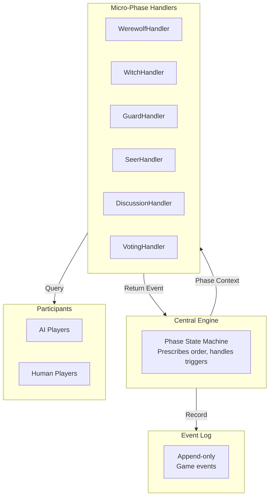
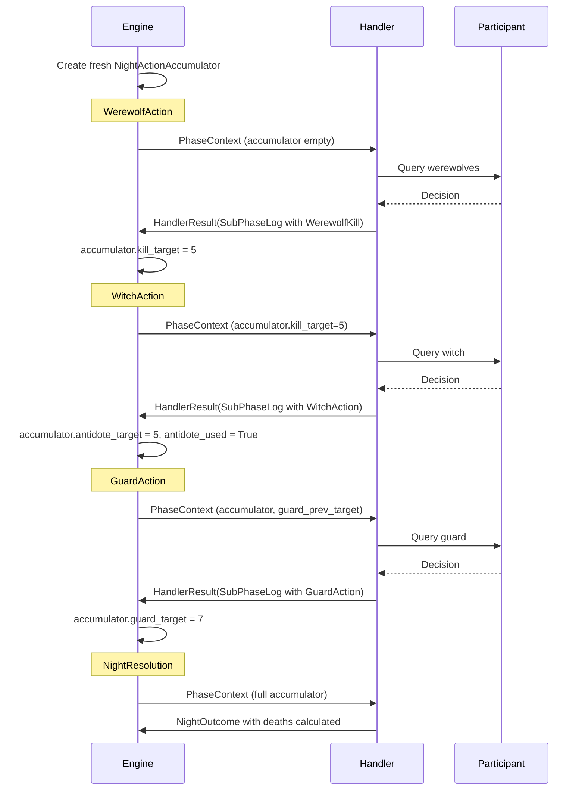
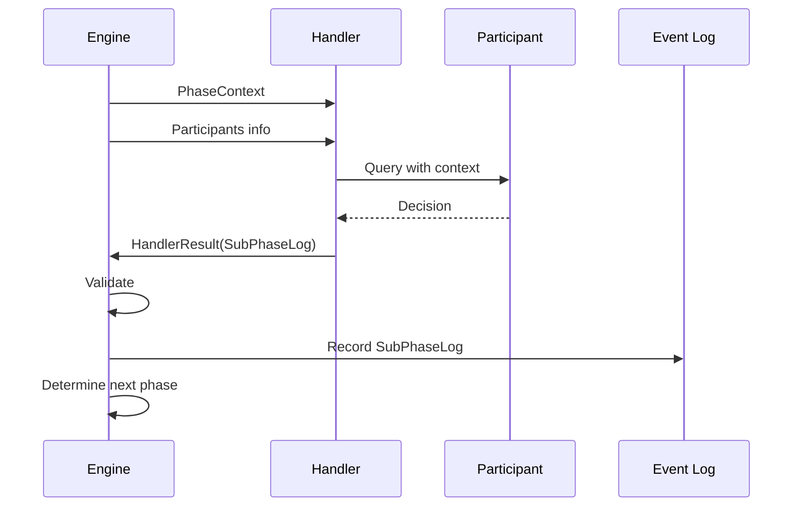

# Micro-Phase Handlers: Input & Output Specification

## Overview

Micro-phase handlers are **system components** that:
1. Receive context about the current game state
2. Query participants (AI or human) for decisions
3. Return game events for the engine to process

The engine controls phase transitions. Handlers manage the flow within their assigned subphase.

---

## Architecture



---

## Handler Interface

### Input: PhaseContext

```python
class PhaseContext(BaseModel):
    """Context passed to handlers by the engine."""

    # Current phase identification
    phase: Phase  # NIGHT, DAY, or GAME_OVER
    sub_phase: SubPhase  # Specific subphase

    # Game state
    day: int
    night: int

    # Player state
    players: dict[int, Player]  # Full player state
    living_players: set[int]
    dead_players: set[int]

    # Night actions accumulated so far (for night phases)
    night_actions: Optional[NightActionAccumulator] = None

    # Current Sheriff (for vote weight and speaking order)
    sheriff: Optional[int] = None
```

### Output: HandlerResult

```python
from .event_log import SubPhaseLog

class HandlerResult(BaseModel):
    """Output from handlers."""

    subphase_log: SubPhaseLog  # All events from this subphase
    debug_info: Optional[str] = None
```

Handler manages the entire subphase and returns all events wrapped in a SubPhaseLog. Engine adds the SubPhaseLog to the current PhaseLog and determines the next subphase based on prescribed order.

---

## Per-Subphase Input/Output

### Night Subphases

| SubPhase | Input Context | Output Event |
|----------|---------------|--------------|
| **WerewolfAction** | Any werewolf seat | `WerewolfKill` |
| **WitchAction** | Witch, `night_actions.kill_target`, `night_actions.antidote_used`, `night_actions.poison_used` | `WitchAction` |
| **GuardAction** | Guard, `night_actions.guard_prev_target` | `GuardAction` |
| **SeerAction** | Seer seat | `SeerAction` |
| **NightResolution** | All `night_actions` fields | `NightOutcome` |

**Night Phase Flow:** WerewolfAction -> WitchAction -> GuardAction -> SeerAction -> NightResolution

### Day Subphases (Day 1)

| SubPhase | Input Context | Output Event |
|----------|---------------|--------------|
| **Campaign** | Candidate seat | `Speech` |
| **OptOut** | Candidate seat | `SheriffOptOut` |
| **SheriffElection** | All `living_players` | `SheriffOutcome` |
| **DeathResolution** | Deaths from night | `DeathEvent` |
| **Discussion** | Speaker seat | `Speech` |
| **Voting** | Voter seat | `Vote` |

**Day 1 Flow:** Campaign -> OptOut -> SheriffElection -> DeathResolution -> Discussion -> Voting

### Day Subphases (Day 2+)

| SubPhase | Input Context | Output Event |
|----------|---------------|--------------|
| **DeathResolution** | Deaths from night | `DeathEvent` |
| **Discussion** | Speaker seat | `Speech` |
| **Voting** | Voter seat | `Vote` |

**Day 2+ Flow:** DeathResolution -> Discussion -> Voting

### DeathResolution Phase

The `DeathResolution` phase handles all deaths and their triggered events.

**Input:**

```
- deaths: List of dead player seats from night
- players: Full state with roles
```

**Output:**

```python
DeathEvent(
    actor=int,  # Dead player's seat
    cause=DeathCause,
    last_words=str | None,
    hunter_shoot_target=int | None,  # None = hunter skipped
    badge_transfer_to=int | None,
    day=day,
    phase=Phase.DAY,
    sub_phase=SubPhase.DEATH_RESOLUTION
)
```

**Processing:**

1. For each death, create a `DeathEvent` event
2. Include `last_words` if the player has any (night deaths Night 1, day deaths always)
3. If Hunter dies: set `hunter_shoot_target` (None = skipped)
4. If Sheriff dies: include `badge_transfer_to`
5. VictoryCheck is evaluated after all death-triggered events

---

## Detailed Subphase Specifications

### WerewolfAction

**Purpose:** Werewolves decide on a kill target.

**Input:**
```
- players: Full state with roles
- living_players: All living players
```

**Output:** `HandlerResult` containing `SubPhaseLog` with `WerewolfKill` event.

**Rules:**
- If no werewolves alive, phase is skipped
- Target must be a living player

---

### WitchAction

**Purpose:** Witch decides to use antidote, poison, or pass.

**Input:**
```
- players: Full state
- living_players: Living players
- night_actions.kill_target: Who werewolves targeted
```

**Output:** `HandlerResult` containing `SubPhaseLog` with `WitchAction` event.

**Rules:**
- Witch knows werewolf's target before deciding
- Antidote can only be used on werewolf's target
- Poison ignores guard protection

---

### GuardAction

**Purpose:** Guard protects a player.

**Input:**
```
- players: Full state
- living_players: Living players
- night_actions.guard_prev_target: Who Guard protected last night
```

**Output:** `HandlerResult` containing `SubPhaseLog` with `GuardAction` event.

**Rules:**
- Cannot guard the same person two consecutive nights

---

### SeerAction

**Purpose:** Seer checks a player's identity.

**Input:**
```
- players: Full state
- living_players: Living players
```

**Output:** `HandlerResult` containing `SubPhaseLog` with `SeerAction` event.

**Rules:**
- Result is computed by engine based on target's role

---

### NightOutcome

**Purpose:** Calculate all deaths and update state.

**Input:**
```
- All night action events accumulated
- players: Full state with roles
```

**Output:** `HandlerResult` containing `SubPhaseLog` with `NightOutcome` event.

**Death Calculation (engine logic):**
1. Start with werewolf target (WEREWOLF_KILL)
2. If antidote used on target: target survives
3. If guard protected target: target survives
4. If poison used: that player dies (POISON)
5. Build death dict: `{seat: DeathCause}`

**Note:** Death causes are stored because:
- Hunter can only shoot if killed by werewolves (WEREWOLF_KILL)
- Hunter cannot shoot if poisoned (POISON)

---

### Campaign

**Purpose:** Day 1 Sheriff candidates give speeches.

**Input:**
```
- day: Current day (must be 1)
- players: Full state
- sheriff: Current Sheriff (None on Day 1)
```

**Output:** `HandlerResult` containing `SubPhaseLog` with `Speech` events.

**Rules:**
- Only Day 1
- Sheriff speaks LAST

---

### OptOut

**Purpose:** Day 1 candidates may drop out.

**Input:**
```
- day: Current day (must be 1)
```

**Output:** `HandlerResult` containing `SubPhaseLog` with `SheriffOptOut` events.

---

### SheriffOutcome

**Purpose:** Vote for Sheriff (Day 1 only).

**Input:**
```
- living_players: All alive players (must vote)
- sheriff_candidates: After opt-outs
```

**Output:** `HandlerResult` containing `SubPhaseLog` with `SheriffOutcome` event.

**Rules:**
- All living players vote (no abstention)
- Sheriff's vote counts 1.5
- Majority wins
- If tie: no Sheriff

---

### Discussion

**Purpose:** Players discuss and debate.

**Input:**
```
- players: Full state
- living_players: All alive
- sheriff: Current Sheriff (for speaking order)
```

**Output:** `HandlerResult` containing `SubPhaseLog` with `Speech` events.

**Rules:**
- Sheriff speaks LAST
- Others alternate clockwise/counter-clockwise

---

### Voting

**Purpose:** Vote to banish a player.

**Input:**
```
- living_players: All alive
- sheriff: Current Sheriff (vote weight = 1.5)
```

**Output:** `HandlerResult` containing `SubPhaseLog` with `Vote` events.

**Rules:**
- All living players vote
- Abstention allowed

---

### VictoryOutcome

**Purpose:** Check if game has ended.

**Input:**
```
- Full game state
- All events so far
```

**Output:** `HandlerResult` containing `SubPhaseLog` with `VictoryOutcome` event.

**Victory Conditions:**

- Werewolves win: ALL_GODS_KILLED or ALL_VILLAGERS_KILLED
- Villagers win: ALL_WEREWOLVES_KILLED or ALL_WEREWOLVES_BANISHED

---

## Night Action Accumulator

**Created fresh each night by the Engine. Handlers receive it as read-only.**

The engine:
1. Creates a new accumulator at the start of each night
2. Passes it to handlers who need to read from it (Witch, Guard, NightResolution)
3. Reads each handler's returned event and updates the accumulator
4. Uses it during NightResolution to calculate deaths

```python
class NightActionAccumulator(BaseModel):
    """Accumulates night actions for resolution (fresh each night).

    All fields are read-only for handlers. Engine populates fields after
    reading handler events, and pre-fills persistent state (antidote_used,
    poison_used, guard_prev_target) from engine storage each night.
    """

    # From WerewolfAction (engine fills after WerewolfKill event)
    kill_target: Optional[int] = None

    # From WitchAction (engine fills after WitchAction event)
    antidote_target: Optional[int] = None
    poison_target: Optional[int] = None

    # Persistent witch state (engine pre-fills from storage)
    antidote_used: bool = False
    poison_used: bool = False

    # From GuardAction (engine fills after GuardAction event)
    guard_target: Optional[int] = None

    # Persistent guard state (engine pre-fills from storage)
    guard_prev_target: Optional[int] = None

    # Computed by engine during NightResolution
    deaths: list[int] = Field(default_factory=list)
```

**Night Phase Flow:**



---

## Execution Flow



---

## Deferred to Future Milestones

The following are **out of scope** for this milestone:

1. **Participant filtering logic** - What information each role can see
2. **StrategicContext** - Rich context for AI decision-making
3. **AI prompting templates** - How to query AI players
4. **Human input handling** - Console/UI for human players

These will be addressed in subsequent design documents.

---

## Key Design Principles

1. **Handlers manage flow** - They orchestrate participants within a subphase
2. **Engine controls transitions** - Prescribed flow enforced centrally
3. **Events are the output** - Handlers return events, engine records them
4. **Engine validates** - Handlers don't mutate state directly
5. **Context is complete** - Handler receives everything needed for the phase
